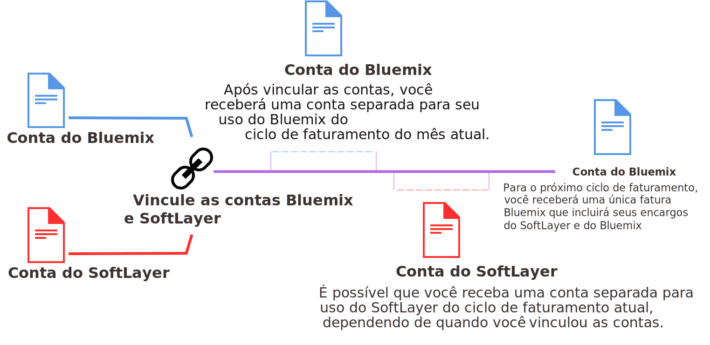

---

copyright:

  Anos: 2015, 2017 lastupdated: "2017-05-31"

---

{:shortdesc: .shortdesc}
{:codeblock: .codeblock}
{:screen: .screen}
{:new_window: target="_blank"}

# Vinculando suas contas do Bluemix e do SoftLayer
{: #unifyingaccounts}

É possível vincular suas contas do {{site.data.keyword.Bluemix_notm}} e do SoftLayer para usar os recursos combinados. Ao vincular suas contas do {{site.data.keyword.Bluemix_notm}} e do Softlayer, você receberá uma única fatura do {{site.data.keyword.Bluemix_notm}}. Se você tiver uma conta do {{site.data.keyword.Bluemix_notm}} existente, o faturamento por meio de recursos do {{site.data.keyword.Bluemix_notm}} for SoftLayer entra em vigor para o novo ciclo de faturamento que se inicia após as contas serem vinculadas.

**Importante:** todas as contas vinculadas no {{site.data.keyword.Bluemix_notm}} devem ser contas de Pagamento por uso. É possível criar uma nova conta de Pagamento por uso, vincular uma conta de Pagamento por uso existente ou vincular uma conta para teste existente (que será em seguida submetida a upgrade para uma conta de Pagamento por uso). Não é possível vincular contas de assinatura do {{site.data.keyword.Bluemix_notm}}.

Deve-se ser um usuário principal na conta do SoftLayer para vincular contas.

Quando suas contas estiverem vinculadas:

* Deve-se usar as credenciais IBMid para acessar as contas do SoftLayer e do {{site.data.keyword.Bluemix_notm}}.
* Quaisquer descontos existentes do SoftLayer são aplicados em encargos do {{site.data.keyword.Bluemix_notm}}.
* Você receberá uma única fatura em dólares dos Estados Unidos (USD).
* Será possível monitorar o uso dos recursos do {{site.data.keyword.Bluemix_notm}} no console do {{site.data.keyword.BluSoftlayer}}.

**Atenção:** depois de vincular suas contas, elas não poderão ser desvinculadas.  

Como usuário principal, conclua as etapas a seguir para vincular suas contas do {{site.data.keyword.Bluemix_notm}} e do SoftLayer:

 1. A partir do {{site.data.keyword.slportal}}, clique em **Vincular uma Conta do {{site.data.keyword.Bluemix_notm}}**.
 2. Leia e aceite os termos para vincular contas do SoftLayer e do {{site.data.keyword.Bluemix_notm}}.
 3. Quando solicitado, forneça o endereço de e-mail que está associado à sua conta do {{site.data.keyword.Bluemix_notm}}. Se você não tiver uma conta do
{{site.data.keyword.Bluemix_notm}}, forneça o endereço de e-mail que deseja usar e, em seguida, siga as instruções para ser convidado para o {{site.data.keyword.Bluemix_notm}} e criar uma
conta.

Após a vinculação de suas contas, **Acessar o {{site.data.keyword.Bluemix_notm}}** ficará disponível na barra de menus do console do SoftLayer. Clicar nesse link conduz você para a
página de login do {{site.data.keyword.Bluemix_notm}}.

## Faturamento para uso do {{site.data.keyword.Bluemix_notm}} quando as contas estão vinculadas
{: #bill_usage}

Após ter vinculado suas contas de cobrança do {{site.data.keyword.Bluemix_notm}} e do SoftLayer, o próximo ciclo de faturamento será cobrado em uma única fatura do {{site.data.keyword.Bluemix_notm}}.
{:shortdesc}

O seu ciclo de uso do {{site.data.keyword.Bluemix_notm}} está em uma base por mês de calendário; portanto, a sua conta será faturada todo mês no dia de faturamento que foi estabelecido para
a sua concordância com os encargos. Com o SoftLayer, o seu ciclo de uso
começa a partir de quando você começou com o SoftLayer; portanto, você é faturado todo mês no mesmo dia do mês em que você se inscreveu para a sua conta do SoftLayer. 

Quando as suas contas estão vinculadas, o seu uso do {{site.data.keyword.Bluemix_notm}} continuará a ser medido para o ciclo do mês atual e você será faturado por esse uso em uma conta do {{site.data.keyword.Bluemix_notm}}. Iniciando no primeiro dia do próximo mês, seus encargos do {{site.data.keyword.Bluemix_notm}} e do SoftLayer serão combinados em sua fatura do {{site.data.keyword.Bluemix_notm}}.

Por exemplo, se você tiver vinculado suas contas em 16 de abril de 2017, obterá uma fatura do Bluemix para seu uso de abril. Dependendo de quando você vinculou as suas contas, você poderá ter uma conta separada para o uso do SoftLayer. Seu uso durante Maio para o SoftLayer e o {{site.data.keyword.Bluemix_notm}} será faturado por meio de sua conta do {{site.data.keyword.Bluemix_notm}}.

Após a vinculação de suas contas, sua fatura do {{site.data.keyword.Bluemix_notm}} listará os diferentes encargos de cada recurso usado.

## Serviços do Bluemix baseados em API
{: #api_based_bluemix_services}

A lista a seguir contém os serviços que podem ser configurados para execução com seu código do aplicativo.
{:shortdesc}

Nem todos os planos para esses serviços estão disponíveis para uso com as contas vinculadas do {{site.data.keyword.Bluemix_notm}} e do SoftLayer. Somente os planos ativados para contas de Pagamento por uso estão disponíveis para uso com contas vinculadas. No entanto, se você tiver uma conta do {{site.data.keyword.Bluemix_notm}} separada que seja faturada separadamente, será possível usar qualquer plano para qualquer um desses serviços.

* {{site.data.keyword.alchemyapishort}}
* {{site.data.keyword.alertnotificationshort}}
* {{site.data.keyword.sparks}}
* {{site.data.keyword.appseccloudshort}}
* {{site.data.keyword.blockchain}}
* {{site.data.keyword.cloudant}}
* {{site.data.keyword.conceptinsightsshort}}
* {{site.data.keyword.iotmapinsights_short}}
* {{site.data.keyword.dashdbshort}}
* {{site.data.keyword.dialogshort}}
* {{site.data.keyword.documentconversionshort}}
* {{site.data.keyword.twittershort}}
* {{site.data.keyword.weather_short}}
* {{site.data.keyword.iotdriverinsights_short}}
* {{site.data.keyword.geospatialshort_Geospatial}}
* {{site.data.keyword.graphshort}}
* {{site.data.keyword.iotelectronics}}
* {{site.data.keyword.languagetranslationshort}}
* {{site.data.keyword.messagehub}}
* {{site.data.keyword.mqa}}
* {{site.data.keyword.mobileappbuilder_short}}
* {{site.data.keyword.mql}}
* {{site.data.keyword.nlclassifiershort}}
* {{site.data.keyword.objectstorageshort}}
* {{site.data.keyword.personalityinsightsshort}}
* {{site.data.keyword.presenceinsightsshort}}
* {{site.data.keyword.relationshipextractionshort}}
* {{site.data.keyword.retrieveandrankshort}}
* {{site.data.keyword.servicediscoveryshort}}
* {{site.data.keyword.speechtotextshort}}
* {{site.data.keyword.sqldb}}
* {{site.data.keyword.streaminganalyticsshort}}
* {{site.data.keyword.texttospeechshort}}
* {{site.data.keyword.toneanalyzershort}}
* {{site.data.keyword.tradeoffanalyticsshort}}
* {{site.data.keyword.visualinsightsshort}}
* {{site.data.keyword.visualrecognitionshort}}
* {{site.data.keyword.workflow}}
* {{site.data.keyword.workloadscheduler}}
